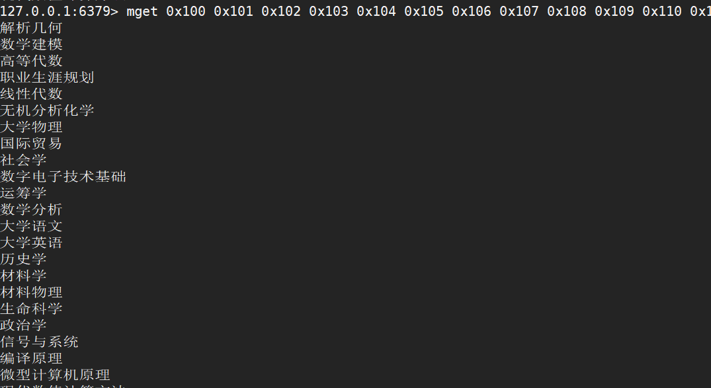
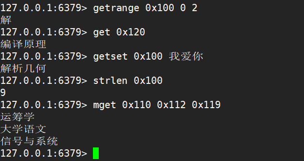
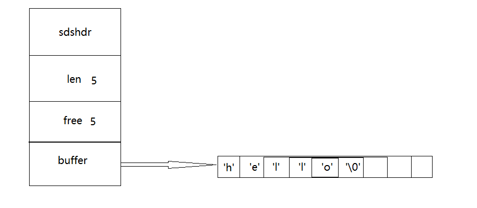

* [string](#string)
	* [string 方法](#string-方法)
	* [存储原理](#存储原理)
	* [案例](#案例)
		* [基本插入与查询操作](#基本插入与查询操作)
	* [string 的实现](#string-的实现)

# string

可以存储的实值：字符串、整数、浮点数

操作：对整个字符串或者字串进行操作，对整数、浮点数进行自增 or 自减操作

## string 方法

- <font>set：设置指定 key 的值（set key value）</font>
- <font>get：获取指定 key 的值（get key）</font>
- <font>getrange：返回 key 中子字符串（语法：getrange key start end：下标）</font>
- <font>getset：将给定 key 的值设为 value，并返回 key 的旧值 old value（语法：getset key value）</font>
- <font>getbit：对 key 所存储的字符串值，获取指定偏移量上的位（语法：getbit key offset）</font>
- <font>mget：获取多个 key 对应的 value（语法：mget key1 key2 key3）</font>
- <font>setbit：对 key 所存储的字符串值，设置或清除指定偏移量上的位（语法：setbit key offset value）</font>
- <font>setex：将值 value 关联到 key，并将 key 的过期时间设置为 seconds（语法：setex key seconds value）</font>
- <font>setnx：只有在 key 不存在时设置 key 的值</font>
- <font>setrange：用 value 参数覆写给定 key 所储存的字符串值，从偏移量 offset 开始（语法：setrange key offset  value）</font>
- <font>strlen：返回 key 所存储字符串的长度（语法：strlen key）</font>
- <font>mset：同时设置一个或多个 key-value 对（语法：mset key1 value1 key2 value2）</font>
- <font>msetnx：同时设置一个或多个 key-value 对，当且仅当所有给定 key 都不存在（msetnx key1 value1 key2 value2）</font>
- <font>psetex：这个命令和 SETEX 命令相似，但它以毫秒为单位设置 key 的生存时间，而不是像 SETEX 命令那样，以秒为单位（语法：psetex key milliseconds value）</font>
- <font>incr：将 key 中储存的数字值增一（incr key）</font>
- <font>incrby：将 key 所储存的值加上给定的增量值（incrby key increment）</font>
- <font>incrbyfloat：将 key 所储存的值加上给定的浮点增量值（incrbyfloat key increment）</font>
- <font>decr：将 key 中存储的数字值减一（decr key）</font>
- <font>decrby：key 所储存的值减去给定的减量值（decrby key decrement）</font>
- <font>append：如果 key 已经存在并且是一个字符串， APPEND 命令将指定的 value 追加到该 key 原来值（value）的末尾（append key value）</font>

## 存储原理


## 案例

### 基本插入与查询操作

<font></font>

<font color=red>getrange、get、getset、mget、strlen</font>

<font></font>

## string 的实现

```cpp
struct sdshdr
{
    //记录 buffer 数组中已使用字节的数量，等于 SDS 所保存字符串的长度
    int len;
    
    //记录 buffer 数组中未使用字节的数量
    int free;
    
    //字符数组，用于保存字符串
    char buffer[];
};
```

数据存储：

<font></font>

<font>相比较于 C 中的 string，Redis 这样做的优点：</font>

- 获取字符串长度的时间复杂度 O(1)
- 不会造成缓冲区溢出

```cpp
char* scrcat(char* dest, const char* src);
```

C 中使用函数将一个字符串添加到另一个字符串默认是认为字符串剩余空间足够容纳添加的，但是事实可能并不够，会造成缓冲溢出。

但是 Redis 再每一次执行字符串拼接的过程前都会判断当前剩余的 free 是否能够存下需要拼接的字符串，因此不会造成溢出。

- 减少修改字符串带来的内存重分配次数

每次进行字符串扩容或者收缩时会进行较为复杂的操作，这会造成过多系统资源的消耗

在 Redis 中，其使用了内存预分配法，因此减少了扩容和收缩的频率，并且 Redis 删除元素后，多余出来的空间不会被回收，为以后的添加做准备

- 二进制安全：C 中以 "\0" 来判断字符串结束标志而 Redis 中以 len 来判断字符串结束标志
- 由于 buffer 本质上是一个字符数组，所以兼容 C 中string 的部分操作