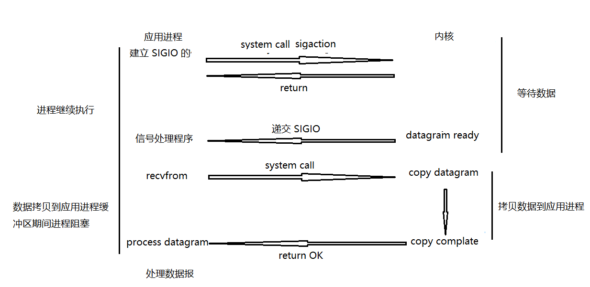

* [基本概念](#基本概念)
	* [同步 vs 异步](#同步-vs-异步)
	* [阻塞 vs 非阻塞](#阻塞-vs-非阻塞)
	* [并发 vs 并行](#并发-vs-并行)
	* [同步 vs 互斥](#同步-vs-互斥)
* [I/O 模型](#io-模型)
	* [阻塞式 I/O](#阻塞式-io)
	* [非阻塞式 I/O](#非阻塞式-io)
	* [I/O 复用（I/O 多路转接）](#io-复用io-多路转接)
	* [信号驱动 I/O](#信号驱动-io)
	* [异步 I/O](#异步-io)
* [I/O 复用](#io-复用)
	* [select](#select)
	* [poll](#poll)
	* [epoll](#epoll)
	* [比较](#比较)
	* [应用场景](#应用场景)
	* [epoll 工作模式](#epoll-工作模式)

# 基本概念

## 同步 vs 异步

- **同步**:为了完成某种功能，但是不具备完成条件，则等待直到完成功能;例如：我叫你去吃饭，叫完你不去，那我就会一直等你，直到你和我一起去吃饭。这叫同步！
- **异步**:为了完成某种功能，但是不具备完成条件，则立即返回（将该功能交给操作系统，来完成，则通过一种方式（信号通知）告诉我们功能完成）例如：我叫你去吃饭，叫完不管你去不去，我都不会等你，我自己去吃饭。这叫异步！

同步与异步：为了完成某种功能，在条件不具备时，会不会发生阻塞

## 阻塞 vs 非阻塞

- **阻塞**：为了完成某一功能，发起一个调用，但是如果不具备完成此功能的必要条件，则等待直到条件满足；

- **非阻塞**：为了完成某一功能，发起一个调用，但是如果不具备完成此功能的必要条件，则报错返回；

## 并发 vs 并行

- **并发**：当有多个线程在操作时，如果系统只有一个 CPU，则它根本不可能真正同时进行一个以上的线程，它只能把 CPU 运行时间划分成若干个时间段，再将时间段分配给各个线程执行，在一个时间段的线程代码运行时，其它线程处于挂起状。这种方式我们称之为并发
- **并行**：当系统有一个以上 CPU 时，则线程的操作有可能非并发。当一个 CPU 执行一个线程时，另一个 CPU可以执行另一个线程，两个线程互不抢占 CPU 资源，可以同时进行，这种方式我们称之为并行

## 同步 vs 互斥

- **同步**：
- **互斥**:

# I/O 模型

一个输入操作通常包括两个操作：等待数据准备好、从内核向进程复制数据

对于一个套接字上的输入操作，第一部通常涉及等待的数据从网络中传达，当所等待数据到达时，它被复制到内核的某个缓冲区中，第二部就是将数据从内核的缓冲区中复制到应用进程的缓冲区

## 阻塞式 I/O

应用进程被阻塞，直到数据从内核缓冲区中复制到应用进程缓冲区中才返回

**注意**：在阻塞的过程中，其他应用进程还可以执行，因此阻塞并不意味着整个操作系统都被阻塞，因为其他应用进程可以执行，所以不消耗 CPU 时间，因此这种模型的 CPU 利用效率比较高

**详细过程**：recvfrom() 用于接收 Socket 传来的数据，并复制到应用进程的缓冲区中，这里吧 recvfrom 当成系统调用

**描述**：recvfrom 发起系统调用，想要从内核中拷贝数据至应用进程缓冲区中，但是内核中数据还没准备好，直到数据准备好，才将数据拷贝至应用进程缓冲区，拷贝完成后返回

## 非阻塞式 I/O

应用进程执行系统调用后，内核返回一个错误码 EWOULDBLOCK，应用进程可以继续执行，但是要不断的执行系统调用来获取 I/O 是否完成，这种方式称为轮询

由于 CPU 要处理更多的系统调用，因此这种模型的 CPU 利用率低

**过程**：

## I/O 复用（I/O 多路转接）

使用 select 和 epoll 等待数据，并且可以等待多个套接字中的任何一个变为可读，这一过程会被阻塞，当某一个套接字可读时返回，之后在使用 recvfrom 再把数据复制到进程缓冲区

多路转接，它可以让单个进程具有处理多个 I/O 事件的能力。又称为事件驱动 I/O

如果一个 Web 服务器没有I/O 复用，那么每一个Socket 连接都需要创建一个线程去处理，如果同时有几十万个连接就需要创建几十万个线程去处理，。相比于多线程和多线程技术，I/O 复用不需要进程线程创建和切换的开销，系统开销更小

**过程**：

## 信号驱动 I/O

应用进程中使用 sigaction 系统调用，内核立即返回，应用进程还可以继续执行，也就是说在数据等待阶段应用进程是非阻塞的。内核在数据到达时向应用进程发送 SIGIO 信号，应用进程收到之后在信号处理程序中调用 recvfrom 将数据从内核中拷贝到应用进程缓冲区中

相比于非阻塞 I/O 轮询的方式，信号驱动 I/O CPU 的利用率更高

**过程**：

## 异步 I/O

应用进程执行 aio_read 系统调用立即返回，应用进程继续执行，不会被阻塞，内核会在所有操作完成之后向应用进程发送信号

异步 I/O 于信号驱动 I/O 的区别在于，异步 I/O 的信号是通知应用进程 I/O 完成，而信号驱动 I/O 的信号是通知应用进程可以开始 I/O

**过程**：

# I/O 复用

## select

## poll

## epoll

## 比较

## 应用场景

## epoll 工作模式

