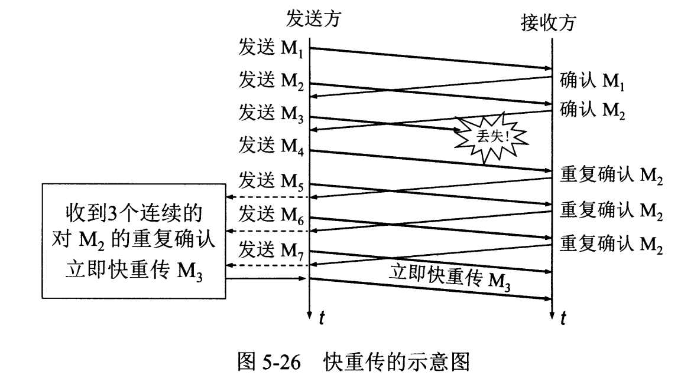

* [端口号](#端口号)
	* [常见知名端口号](#常见知名端口号)
* [UDP 和 TCP 的特点](#udp-和-tcp-的特点)
* [UDP 首部格式](#udp-首部格式)
* [TCP 首部格式](#tcp-首部格式)
* [TCP 的三次握手](#tcp-的三次握手)
* [TCP 的四次挥手](#tcp-的四次挥手)
* [TCP 的可靠传输](#tcp-的可靠传输)
* [TCP 滑动窗口](#tcp-滑动窗口)
* [TCP 流量控制](#tcp-流量控制)
* [TCP 拥塞控制](#tcp-拥塞控制)
	* [慢开始与拥塞避免](#慢开始与拥塞避免)
	* [快重传与快恢复](#快重传与快恢复)
* [TCP 和 UDP 的区别](#tcp-和-udp-的区别)

# 端口号

​	TCP/IP 协议中，用源 IP，源端口号，目的 IP，目的端口号，协议号这样的一个五元组来标识一个通信（可用 `netstat -n` 查看）

## 常见知名端口号

- ssh 服务器：端口号 22
- ftp 服务器：端口号 21
- telnet 服务器：端口号 23
- http 服务器：端口号 80
- https 服务器：端口号 443
- 执行命令`cat /etc/services`查看知名端口号

**两个问题：一个进程是否可以绑定多个端口号 | 多个进程绑定一个端口号**

# UDP 和 TCP 的特点

- 用户数据报协议 UDP 是无连接的，尽最大的可能交付，没有拥塞控制，面向报文（对于应用程序传下来的报文不合并也不拆分，只是添加 UDP 首部），支持一对一、一对多、多对一的交互通信
- 传输控制协议 TCP 是面向连接的，提供可靠交付，有流量控制，拥塞控制，提供全双工通信，面向字节流（把应用层传下来的报文当作字节流，把字节流组织成大小不等的数据块），每一条 TCP连接只能是点对点的（一对一）

# UDP 首部格式

​	

​	首部字段只有 8 个字节，包括源端口、目的端口、长度、检验和。12 字节的伪首部是为了计算检验和临时添加的。

# TCP 首部格式

- **序号**：用于对字节流进行编号，例如序号：301，表示第一个字节的编号为 301，如果携带的数据长度为 100 字节，那么下一个报文的序号是 401
- **确认号**：期望收到下一个报文的序号，例如 B 收到 A 发过来的一个报文段，序号为 501，携带的数据长度为 200，因此 B 期望收到下一个报文段的序号为 701，B 发送给 A 的确认报文段中确认好就是 701
- **数据偏移**：指的是数据部分距离报文起始段的偏移量，实际上指的是首部长度
- **确认 ACK**：当 ACK = 1 时确认号字段有效，否则无效；TCP 规定，在建立连接后所有传送的报文段都必须报 ACK 置 1
- **同步 SYN**：在建立连接时用于同步序号，当 SYN = 1，ACK = 0 时表示这是一个连接请求报文段，若对方同意请求建立连接，则响应报文中 SYN = 1，ACK = 1；
- **终止 FIN**：用来释放一个连接，当 FIN = 1 时表示此报文发送端的数据已发送完毕，并要求释放连接
- **窗口**：窗口值作为接收方让发送方设置其发送窗口的依据，之所以要这个限制，是因为接收方的数据缓存空间是有限的

# TCP 的三次握手

假设 A 为客户端，B 为服务器端。

- 首先 B 处于 LISTEN（监听）状态，等待客户的连接请求。
- A 向 B 发送连接请求报文，SYN=1，ACK=0，选择一个初始的序号 x。
- B 收到连接请求报文，如果同意建立连接，则向 A 发送连接确认报文，SYN=1，ACK=1，确认号为 x+1，同时也选择一个初始的序号 y。
- A 收到 B 的连接确认报文后，还要向 B 发出确认，确认号为 y+1，序号为 x+1。
- B 收到 A 的确认后，连接建立。

**三次握手的原因**

​	第三次握手是为了防止失效的连接请求到达服务器，让服务器错误打开连接。

​	客户端发送的连接请求如果在网络中滞留，那么就会隔很长一段时间才能收到服务器端发回的连接确认。客户端等待一个超时重传时间之后，就会重新请求连接。但是这个滞留的连接请求最后还是会到达服务器，如果不进行三次握手，那么服务器就会打开两个连接。如果有第三次握手，客户端会忽略服务器之后发送的对滞留连接请求的连接确认，不进行第三次握手，因此就不会再次打开连接

# TCP 的四次挥手

​	以下描述不讨论序号和确认号，因为序号和确认号的规则比较简单。并且不讨论 ACK，因为 ACK 在连接建立之后都为 1。

- A 发送连接释放报文，FIN=1。
- B 收到之后发出确认，此时 TCP 属于半关闭状态，B 能向 A 发送数据但是 A 不能向 B 发送数据。
- 当 B 不再需要连接时，发送连接释放报文，FIN=1。
- A 收到后发出确认，进入 TIME-WAIT 状态，等待 2 MSL（最大报文存活时间）后释放连接。
- B 收到 A 的确认后释放连接。

**四次挥手的原因**

​	客户端发送了 FIN 连接释放报文之后，服务器收到了这个报文，就进入了 CLOSE-WAIT 状态。这个状态是为了让服务器端发送还未传送完毕的数据，传送完毕之后，服务器会发送 FIN 连接释放报文。

**TIME_WAIT**

​	客户端接收到服务器端的 FIN 报文后进入此状态，此时并不是直接进入 CLOSED 状态，还需要等待一个时间计时器设置的时间 2MSL。这么做有两个理由：

- 确保最后一个确认报文能够到达。如果 B 没收到 A 发送来的确认报文，那么就会重新发送连接释放请求报文，A 等待一段时间就是为了处理这种情况的发生。
- 等待一段时间是为了让本连接持续时间内所产生的所有报文都从网络中消失，使得下一个新的连接不会出现旧的连接请求报文。

# TCP 的可靠传输

TCP 使用超时重传来实现可靠传输，如果一个已经发送的报文段在超时时间内没有得到确认，那么就重传这个报文段。

一个报文段从发送再到接收确认所经过的时间称为往返时间 RTT，加权平均往返时间 RTTs 计算如下：
$$
RTTs=(1-a)*(RTTs)+a*RTT
$$
其中，0 <= a < 1，RTTs 随着 a 的增加更容易受到 RTT 的影响

超时时间 RTO 应该略大于 RTTs，TCP 使用的超时时间计算如下
$$
RTO=RTTs+4*RTTd
$$
其中 RTTd 为偏差的加权平均值

# TCP 滑动窗口

窗口是缓存的一部分，用来暂时存放字节流。发送方和接收方各有一个窗口，接收方通过 TCP 报文段中的窗口字段告诉发送方自己窗口的大小，发送方根据这个值和其他信息设置自己的窗口大小

发送窗口内的字节都允许被发送，接收窗口内的字节都允许被接收，如果发送窗口左部的字节已经发送并且得到了确认，那么就将发送窗口向右滑动一段距离，直到左部第一个字节不是已发送并且确认的状态；接收窗口滑动类似，接收窗口左部字节发送确认并且交付主机，就向右滑动接收窗口

接收窗口只会对窗口内最后一个按序到达的字节进行确认，例如窗口已收到的字节为 {{31，34，35}}，其中 31 按序到达，而 {{34，35}} 不是，因此只对 31 字节进行确认，发送方得到一个字节的确认后，就知道这个字节之前的所有字节都已经被接收

# TCP 流量控制

流量控制是为了控制发送方的频率，保证接收方来得及接收

接收方发送的确认报文中的窗口字段可以用来控制发送方窗口大小，从而影响发送方的发送滚率；将窗口字段设置为 0，则发送方并不能发送数据

# TCP 拥塞控制

如果网络出现拥塞，分组将会丢失，此时发送方会继续重传，从而导致网络拥塞程度更高，因此将出现拥塞时，应当控制发送方的速率；这一点和流量控制很像，但是出发点不同。流量控制是为了让接收方能够来得及接收，而拥塞控制是为了降低整个网络的拥塞程度

TCP 主要通过四个算法来进行拥塞控制：慢开始、拥塞避免、快重传、快恢复

发送方需要维护一个拥塞窗口的状态变量，注意拥塞窗口和发送窗口的区别：拥塞窗口只是一个状态变量，实际能决定到底发送多少数据的是发送窗口

假设：

- 接收方有足够的接收缓存，因此不会发生流量控制
- 虽然 TCP　窗口基于字节，但是这里的窗口仍是报文段

## 慢开始与拥塞避免

发送的最初执行慢开始，令 cwnd = 1，发送方只能发送 1 个报文段；当收到确认后，将 cwnd 加倍，因此之后发送方能够发送的报文段数量为：2、4、8 ...

注意到慢开始每个轮次都将 cwnd 加倍，这样会让 cwnd 增长速度非常快，从而使得发送方发送的速度增长速度过快，网络拥塞的可能性也就更高。设置一个慢开始门限 ssthresh，当 cwnd >= ssthresh 时，进入拥塞避免，每个轮次只将 cwnd 加 1。

如果出现了超时，则令 ssthresh = cwnd / 2，然后重新执行慢开始。

## 快重传与快恢复

在接收方，要求每次接收到报文段都应该对最后一个已收到的有序报文段进行确认。例如已经接收到 M1 和 M2，此时收到 M4，应当发送对 M2 的确认。

在发送方，如果收到三个重复确认，那么可以知道下一个报文段丢失，此时执行快重传，立即重传下一个报文段。例如收到三个 M2，则 M3 丢失，立即重传 M3。

在这种情况下，只是丢失个别报文段，而不是网络拥塞。因此执行快恢复，令 ssthresh = cwnd / 2 ，cwnd = ssthresh，注意到此时直接进入拥塞避免。

慢开始和快恢复的快慢指的是 cwnd 的设定值，而不是 cwnd 的增长速率。慢开始 cwnd 设定为 1，而快恢复 cwnd 设定为 ssthresh。

# TCP 和 UDP 的区别

- **基于连接与无连接**

当客户端和一个服务器通过 TCP发送数据时，必先建立连接，俗称TCP握手。此过程控制消息在客户端和服务器之间进行互换来实现。而UDP则是无连接的协议，比如我门的QQ消息

- **可靠性方面**

TCP提供交付保证，确认对方能够收到数据，这便意味着使用TCP协议发送的消息是保证交付给客户端的，如果传输过程中发生丢失，那么它将重发，这是TCP协议自身保证的，

而UDP是不保证消息能够传达给客户端，比如我们给对方发送了一则消息对方收到没收到，我们是不能保证的

- **有序性**

TCP除了保证交付，还有一定的有序性，该消息从服务器发出并以同样的顺序发送到客户端，尽管消息在网络的另一端可能时无序的，这就说明TCP协议会为你排序，而UDP没有任何有序性的保证

- **数据边界**

TCP不保存数据的边界，而UDP保证。在传输控制协议，数据以字节流的形式发送，并没有明显的标志表明传输信号消息（段）的边界。在UDP中，数据包单独发送的，只有当他们到达时，才会再次集成。包有明确的界限来哪些包已经收到，这意味着在消息发送后，在接收器接口将会有一个读操作，来生成一个完整的消息。虽然TCP也将在收集所有字节之后生成一个完整的消息，但是这些信息在传给传输给接受端之前将储存在TCP缓冲区，以确保更好的使用网络带宽

- **传输速度、报头大小、重量级（开销成本）**

由于TCP协议在进行数据传送之前要进行创建连接，并且要提供数据的可靠交付以及序列性的保证，因此TCP协议传输速率较UDP传输协议慢一些。并且TCP要比UDP拥有更大的“头”一个TCP包头大小为20字节；TCP报头中包含ACK号、序列号、数据偏移量、保留、控制位、紧急指针、可选项、填充项、校验位、目的端口与原端口等；而UDP中只包含长度、目的端口、源端口号、校验和

- **拥塞控制与流量窗口**

TCP作为面向连接的提供全双工可靠服务协议，具有差错控制、拥塞控制和流量控制等功能。此处所谓的拥塞控制和流量控制，就是将发送端发送能力、接收端接收信息的能力以及当前的网络环境参与考虑，在网络拥塞情况严重或者接收端接收能力有限的情况下，减缓或暂停消息发送，当情况改善时，增强消息发送能力，加上超时/丢失重发的机制，共同提供可靠传输。