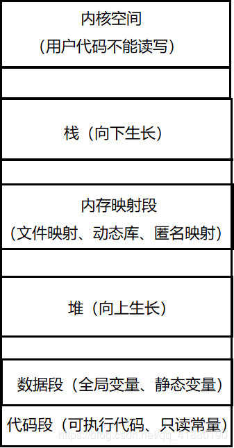

* [一.C/C++内存分布](#一cc内存分布)
* [二.回顾C语言中的动态内存管理](#二回顾c语言中的动态内存管理)
	* [1.面试题1：malloc/calloc/realloc的区别是什么？](#1面试题1malloccallocrealloc的区别是什么)
	* [2.面试题2：32位平台指针为什么是4个字节？](#2面试题232位平台指针为什么是4个字节)
	* [3.面试题3：如何malloc一个大于3G的空间？](#3面试题3如何malloc一个大于3g的空间)
* [三.C++中的内存管理](#三c中的内存管理)
	* [1.new/delete操作内置类型用法](#1newdelete操作内置类型用法)
	* [2.new/delete操作自定义类型用法](#2newdelete操作自定义类型用法)
* [四.operator new和operator delete函数](#四operator-new和operator-delete函数)
* [五.定位new表达式(placement-new)](#五定位new表达式placement-new)
* [六.常见面试题总结](#六常见面试题总结)
	* [1.malloc/free和new/delete的区别？](#1mallocfree和newdelete的区别)
	* [2.请设计一个类，该类只能在堆上创建对象](#2请设计一个类该类只能在堆上创建对象)
	* [3.请设计一个类，该类只能在栈上创建对象](#3请设计一个类该类只能在栈上创建对象)

# 一.C/C++内存分布




*然后我们可以根据上边的这幅图做一下下面这道笔试中一定会遇到的判断存储区的笔试题*

```cpp
int globalVar = 1;
static int staticGlobalVar = 1;
void Test() {    
    static int staticVar = 1;    
    int localVar = 1;        
    int num1[10] = {1, 2, 3, 4};    
    char char2[] = "abcd";    
    char* pChar3 = "abcd";    
    int* ptr1 = (int*)malloc(sizeof (int)*4);         
    int* ptr2 = (int*)calloc(4, sizeof(int));         
    int* ptr3 = (int*)realloc(ptr2,sizeof(int)*4);
    free (ptr1);    
    free (ptr3);
}
//选择题
选项: A.栈  B.堆  C.数据段(全局区、静态区)  D.代码段(常量区)   
globalVar在哪里？__C__   staticGlobalVar在哪里？_C__  
staticVar在哪里？__C_   localVar在哪里？_A__   
num1 在哪里？_A__      char2在哪里？__A_        
*char2在哪里？_A_   pChar3在哪里？__A_      
*pChar3在哪里？_D__   ptr1在哪里？__A_        
*ptr1在哪里？__B_
//填空题
sizeof(num1) = _40_;//sizeof数组名是求数组的大小     
sizeof(char2) = _5__;    strlen(char2) = __4_;   
sizeof(pChar3) = _4|8_;   strlen(pChar3) = _4_;
sizeof(ptr1) = _4|8_;     sizeof(ptr2) = __4|8_;
//4代表在32位的进程空间中，8代表在64位的进程空间中
```

**各段内存说明**：

非静态局部变量/函数参数/返回值等存储在栈中，栈是向下增长的

内存映射段是高效的I/O映射方式，用于装载一个共享的动态内存库。用户可使用系统接口创建共享共享内存，做进程间通信

堆用于程序运行时动态内存分配，堆是向上增长的

数据段存储全局数据和静态数据

代码段存储可执行的代码和只读常量

# 二.回顾C语言中的动态内存管理

## 1.面试题1：malloc/calloc/realloc的区别是什么？

malloc：malloc函数用来分配堆上的空间，按照字节为单位

calloc：calloc函数也是用来开辟堆上的空间，但和malloc的区别是它把这块空间初始化为0，也是按照字节为单位。nmemb指的是分配的字节数，size指的是每个成员占的字节数

realloc：realloc函数是用来调整已开辟的空间，调整方法为：如果该空间后边的空间足够扩大，则直接把后边的空间续上，源指针不变;如果该空间后边的空间不够扩大，则在内存中另外找一块空间，源指针改变指向新的空间，并且自动的将源空间free

free：free函数用来释放前三个函数开辟的空间

malloc 和 calloc 都用于动态分配内存

malloc 参数就是分配内存所需的字节数，不同的是 calloc 参数时需要分配内存的元素个数以及元素所占字节数

calloc 在返回前会把内存初始为零，而 malloc 不会

realloc 可以改变已有内存的大小

**动态内存分配**：

1、malloc 和 free 分别用于执行动态内存的分配和释放

*函数原型*：

```cpp
void* malloc(size_t size);    返回值（开辟成功返回内存首地址）
void free(void* ptr);    //ptr 可以为 NULL
```

如果 malloc 内存池为空，或者可用内存达不到要求这时 malloc 向操作系统请求新的内存空间，并在新分配的内存上分配和执行任务，如果操作系统无法给更多的内存，则返回一个 NULL ；

2、calloc 和 realloc 

```cpp
void* calloc(size_t num+elements, size_t element_size);    元素个数和元素所占字节数
void realloc(void* ptr, size_t new__size);
```

malloc 和 calloc 的主要区别：

后者在返回指向内存的指针之前把它初始为零-----若要存储在数组中，这个初始动作完全浪费；

calloc 和 malloc 另一个均较小的区别：

它们请求内存数量的方式不同；

realloc 修改原先已有的内存大小---可以将内存块扩大或者缩小，如果扩大内存块，那么原先的值依然保留，即追加内存；

如果缩小内存块，则该内存块的尾部的部分被拿掉

如果内存块的大小无法改变， realloc 则重新申请一块正确大小的内存，并复制原来内存上的内容，realloc 之后的旧地址不能使用；

**请求内存失败**：

请求内存分配失败 malloc、realloc、calloc 返回 NULL 指针，访问分配之外的区域引起类似数组下标越界，这样可能会导致程序失败

内存泄漏是指内存被动态分配之后，当它不再使用时未被释放。内存泄漏导致程序体增加，导致程序崩溃

深入理解 C++ 动态内存管理

malloc / free /new / delete 的区别和联系？

1、他们都是动态管理内存的入口

2、malloc / free 是 标准库函数，new / delete 是操作符

3、malloc / free 只是动态分配内存空间 / 释放空间。而 new / delete 除了分配空间意外还会调用构造函数和析构函数进行初始化和清理（清理成员）

4、malloc / free 需要手动计算类型大小且返回值为 void* ，new / delete 可自己计算类型大小，返回对应的指针

5、malloc 失败了会返回 NULL ，new 失败了会抛异常；

什么是抛异常呢？

## 2.面试题2：32位平台指针为什么是4个字节？

## 3.面试题3：如何malloc一个大于3G的空间？

动态内存错误：

对 NULL 的解引用、对分配内存的操作越界、释放非动态开辟内存、释放一半用一半即不完全释放

其中第一大常见错误：

忘记检查请求的内存是否分配成功

第二大错误：

操作内存时超出了所分配的界限，表现如下：明显错误--数组下标；不明显错误：对分配之外的内存操作

内存泄漏：动态分配的内存不使用时，应被释放以便重新分配使用；分配的内存使用完而不释放，----内存泄漏

执行程序共享，同一个内存池的操作系统，内存池将榨干可用内存，唯有重启系统

动态内存分配实例：通常是纳希俄长度只有在程序运行起来时才知道---动态内存释放后不能再被访问

数组被声明时，编译时必须知道其长度

动态内存分配允许程序为一个长度在程序运行起来时才知道---允许给这种情况分配

动态内存分配常见警告：

1、不检查 malloc 返回值是否为 NULL

2、访问内存以外的区域

3、free() 接收一个非动态开辟的指针

4、动态内存释放后又被访问

# 三.C++中的内存管理

## 1.new/delete操作内置类型用法

```cpp
int main()
{
     int* ptr1 = new int;//动态申请一个int类型的空间
     int* ptr2 = new int(2);//动态申请一个int类型的空间并初始化为2
     int* ptr3 = new int[3];//动态申请3个int类型的空间
     int* ptr4 = new int[3]();//动态申请3个int类型的空间并初始化为0
     //int* ptr5 = new int[3](1);不能这么初始化
     delete ptr1;
     delete ptr2;
     delete[] ptr3;
     delete[] ptr4;
     return 0;
}
```

##  2.new/delete操作自定义类型用法

```cpp
class Date
{
public:
     Date()
     {}
     Date(int year, int month, int day)
      :_year(year)
      , _month(month)
      , _day(day)
     {
      cout << "date" << this << endl;
     }
     ~Date()
     {
      cout << "~date" << this << endl;
    }
private:
     int _year;
     int _month;
     int _day;
};
int main()
{
     //C++中new/delete操作自定义类型
     Date* d1 = new Date(2018, 11, 5);
     Date* d2 = new Date[10]();//或者Date* d2 = new Date[10]
     delete d1;
     delete[] d2;
     //C语言中malloc/delete操作自定义类型
     cout << "------------------------" << endl;
     Date* d3 = (Date*)malloc(sizeof(Date));
     Date* d4 = (Date*)malloc(sizeof(Date)* 10);
     free(d3);
     free(d4);
     return 0;
}
```

# 四.operator new和operator delete函数

new(操作符)--->调用operator new(函数)--->调用malloc(函数)--->调用构造

//new失败抛异常(符合C++规范)

//malloc失败返回NULL

delete(操作符)-->调用析构--->调用operator delete(函数)--->free(函数)

operator new实际也是通过malloc来申请空间，如果malloc申请空间成功就直接返回，否则执行用户提供的空间不足应对措施，如果用户提供该措施就继续申请，否则就抛异常。operator delete最终是通过free来释放空间的。operator new和operator delete用户也可以自己实现，用户实现时即可实现成全局函数，也可实现成类的成员函数，但是一般情况下不需要实现，除非有特殊需求

# 五.定位new表达式(placement-new)

定位 new 表达式必须是在已分配的原始内存空间中调用出来的构造函数：

来初始化一个对象

使用格式： new (place_address) type 或者 new (place_address) type (initializer_list)

place_address 必须是一个指针

initialize_list 是类型的初始化列表

使用场景：定位 new 表达式，在实际中配合内存池使用，因为内存池分配出来的内存没有初始化，如果是自定义类型对象需要使用定位 new 表达式进行显示调用构造函数初始化

```cpp
class Date
{
public:
Date()
{}
Date(int year, int month, int day)
  :_year(year)
  , _month(month)
  , _day(day)
{
  cout << "date" << this << endl;
}
~Date()
{
  cout << "~date" << this << endl;
}
private:
int _year;
int _month;
int _day;
};
int main()
{
//d1和d2现在还不是一个对象，因为没有调用构造函数初始化，只能说大小和对象的大小相同
Date* d1 = (Date*)malloc(sizeof(Date));
Date* d2 = (Date*)malloc(sizeof(Date));
//调用new的定位表达式初始化
new(d1)Date(2018, 11, 5);//调用有参构造
new(d2)Date();//调用无参构造
}
```

# 六.常见面试题总结

## 1.malloc/free和new/delete的区别？

共同点：它们都是在堆上开辟空间，而且都需要手动释放。

 

不同点：

malloc/free是函数，而new/delete是操作符，new/delete在底层调用了malloc/free

malloc申请的空间不能直接初始化，而new申请的空间会调用构造函数，可以直接传参初始化

malloc申请空间时，需要手动计算空间大小并传递，new只需在其后跟上空间的类型即可

malloc的返回值为void*, 在使用时必须强转，new不需要，因为new后跟的是空间的类型

malloc申请空间失败时，返回的是NULL，因此使用时必须判空，new不需要，但是new需要捕获异常

malloc/free只能申请内置类型的空间，不能申请自定义类型的空间，因为其不会调用构造与析构函数， 而new可以，new在申请空间后会调用构造函数完成对象的构造，delete在释放空间前会调用析构函数 完成空间中资源的清理

malloc申请的空间一定在堆上，new不一定，因为operator new函数可以重新实现

new/delete比malloc/free的效率稍微低点，因为new/delete的底层封装了malloc/free，存在函数调用的开销

## 2.请设计一个类，该类只能在堆上创建对象

将类的构造函数私有，拷贝构造声明成私有。防止别人调用拷贝在栈上生成对象。

提供一个静态的成员函数，在该静态成员函数中完成堆对象的创建

## 3.请设计一个类，该类只能在栈上创建对象

涉及到的一些代码：

```cpp
#pragma once
 
#include <iostream>
#include <stdlib.h>
#include <string.h>
using namespace std;
 
void func2()
{
	static int c = 10;
	int d = 10;
 
	char* p1 = "hello";
	char p2[] = "hello";
	int* ps = (int*)malloc(4);
	cout << strlen(p1) << endl;;
	cout << strlen(p2) << endl;
	cout << sizeof(p1) << endl;
	cout << sizeof(p2) << endl;
}
void func1()
{
	static int a1 = 10;
	int b = 10;
}
void Test1()
{
	func1();
	func2();
}
void Test2()
{
	int* p1 = new int;
	int* p2 = new int(10);		//调用构造函数
	int* p3 = new int[10];		//开辟数组
	cout << "p1:addr" << p1 << endl;
	cout << "p2:addr" << p2 << endl;
	cout << "p3:addr" << p3 << endl;
	delete p1;
	delete p2;
	delete[] p3;
	cout << "p1:addr" << p1 << endl;
	cout << "p2:addr" << p2 << endl;
	cout << "p3:addr" << p3 << endl;
}
 
//1、内置类型	new -- malloc 本质没区别
//2、自定义类型
//有了 malloc 为什么还要 new 
class AA
{
public:
	AA()
	{
		cout << "AA()" << endl;
	}
	~AA()
	{
		cout << "~AA()" << endl;
	}
};
void TestAA3()
{
	AA* p1 = (AA*)malloc(sizeof(AA));
	free(p1);
	//1、动态开辟空间
	//2、调用构造函数（初始化）和析构函数（清理）
	AA* p2 = new AA; 
	delete p2;
	AA* p3 = new AA[10];
	delete[] p3;	//	如何得知调用多少次析构
}
 
class MyVector
{
public:
	MyVector()
	{
		_a = new int[3];
		cout << "_a:addr" << _a << endl;
		cout << "MyVector()" << endl;
	}
	~MyVector()
	{
		delete _a;
		cout << "~MyVector" << endl;
	}
private:
	int* _a;
};
void TestMyVector4()
{
	MyVector* pv = (MyVector*)malloc(sizeof(MyVector));
	cout << "pv:addr" << pv << endl;
	free(pv);
 
	//char* p1 = (char*)malloc(0x7fffffff);
	//cout << "p1:addr" << p1 << endl;
	MyVector* ptr = new MyVector;
	cout << "ptr:addr" << ptr << endl;
	delete ptr;
}
 
//如何证明 operator new 不是重载
void Test5()
{
	int* p5 = (int*)operator new(4);
	cout << "p5:addr" << p5 << endl;
	int* p6 = (int*)malloc(4);
	cout << "p6:addr" << p6 << endl;
	//为什么会有	operator new
	//new 开空间并且调用构造或函数
	//	new开空间->operator new == malloc + 失败异常
	//2、调用构造
	//3、调用析构
	//4、释放空间	operator delete
 
}
void TestSize6()
{
	cout << sizeof(AA) << endl;
	cout << sizeof(MyVector) << endl;
}
//定位 new 表达式
void Test_allocator()
{
	allocator<AA> alloc;
	AA* p1 = alloc.deallocate(1);	//内存池
}
```