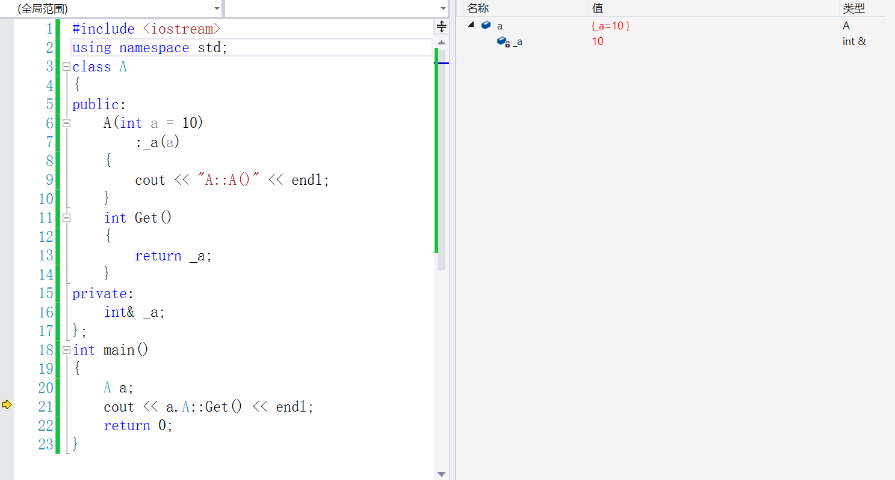

* [C++ 中类成员的访问权限](#c-中类成员的访问权限)
	* [C++ 中的水平权限控制](#c-中的水平权限控制)
	* [C++ 中的垂直访问权限](#c-中的垂直访问权限)
	* [友元函数](#友元函数)
	* [友元类](#友元类)
	* [友元成员函数](#友元成员函数)
* [C++ struct 和 class的区别](#c-struct-和-class的区别)
	* [区别一](#区别一)
	* [区别二](#区别二)
	* [混淆区域](#混淆区域)
	* [总结](#总结)
* [C++ 类内可以定义引用数据成员吗](#c-类内可以定义引用数据成员吗)

# C++ 中类成员的访问权限

## C++ 中的水平权限控制

- 水平权限：在一个类中，成员的权限控制，就是类中的成员函数能否访问其他成员，类的对象能否访问类中的某成员

- 垂直权限：在派生类中，对从基类继承过来的成员的访问

- 内部访问：类中成员函数对其他函数的访问

- 外部访问：通过类的对象，访问类的成员函数或者成员变量，也称之为对象访问

  |  类中属性  | private | protected | public |
  | :--------: | :-----: | :-------: | :----: |
  | 内部可见性 |  可见   |   可见    |  可见  |
  | 外部可见性 | 不可见  |  不可见   |  可见  |

## C++ 中的垂直访问权限

- 派生类可以继承基类除了构造函数和析构函数之外的函数

  |   类成员继承方式    |      public 继承      |    protected 继承     |    private 继承     |
  | :-----------------: | :-------------------: | :-------------------: | :-----------------: |
  |  基类 public 成员   |  派生类 public 成员   | 派生类 protected 成员 | 派生类 private 成员 |
  | 基类 protected 成员 | 派生类 protected 成员 | 派生类 protected 成员 | 派生类 private 成员 |
  |  基类 private 成员  |    在派生类不可见     |    在派生类不可见     |   在派生类不可见    |

## 友元函数

- 非类的成员函数要去访问类中的成员函数或者成员变量，授予他们特别访问权即友元函数

## 友元类

- 有元关系不可被继承
- 友元关西是单向的，不具备交换性，
- 友元类的所有成员函数都是另一个类的成员函数，都可以访问另一个类中的隐藏信息：受保护的成员函数或者私有成员变量

```cpp
class A;
class B
{
public:
    friend class A;	//友元类的声明
}
```


## 友元成员函数

```cpp
class A;	//当用到友元函数时，需注意友元声明与友元定义之间的相互依赖
class B
{
public:
    void set_show(int x, A& a);	//该函数是类 A 的友元函数
};
class A
{
public:
    friend void B::set_show(int x, A& a);	//友元函数的声明
private:
    int data;
    void show()
    {
        cout << data << endl;
    }
};
void B::set_show(int x, A& a)
{
    a.data = x;
    cout << a.data << endl;
}
```

# C++ struct 和 class的区别

## 区别一

C++ 中的 struct 对 C 的 struct 进行了扩充，它已经不仅仅是一个包含不同数据类型的数据结构了，

- C++ 中的 struct 包括成员函数
- C++ 中的 struct 支持继承
- C++ 中的 struct 支持多态

其实，最大的一个区别就是**默认的访问控制权限**

首先，默认的继承访问权限 struct 是 public 的，class 是 private 的

例子:

```cpp
struct A
{
    char a;
};
struct B : A
{
	char b;
};
//这时候 B 是 public 继承 A 的
//如果把 struct 改为 class
class A
{
    char a;
};
class B : A
{
	char b;
};
//此时 B 是 private 继承 A 的
```

默认继承方式是 public 好还是 private 好，取决于派生类而不是基类。

## 区别二

class 可以定义模板参数，而 struct 不可以

## 混淆区域

```cpp
struct A
{
    char c1;
    int n2;
    double db3;
};
A a = {'1',2,3.14};//定义时直接赋值
```

由上述可以看出，struct 可以在定义的时候用 {} 赋值，那么 class 行不行呢，将上面的 struct 改为 class 到底行不行呢，

试着在 struct 中假如构造函数或者虚函数，看看会发生什么？

在 C++ 中 struct 也不可以使用 {} 赋值了，的确，以 {} 的方式来赋值，只是用一个初始化列表来对数据进行按顺序的初始化，如果将上面的 A a = {'s', 1, 3.14} 写成 A a = {'s', 2}，这样前两个数据被初始化，而 db3 没有被初始化，这样简单的 copy 操作，只能发生在简单的数据类型上，而不是应该放在对象上，加入一个构造函数或是一个虚函数会使得 struct 更体现出一种对象的特性，以后 {} 赋值不再适合。

说明：普通成员函数算是对数据结构的一种简单的算法 {} 仍然适合

## 总结

<font color=red>struct 更像是数据结构的实现体，而 class 则是对象的实现体</font>

# C++ 类内可以定义引用数据成员吗



由此可见，在类内定义引用数据成员只能被初始化一次