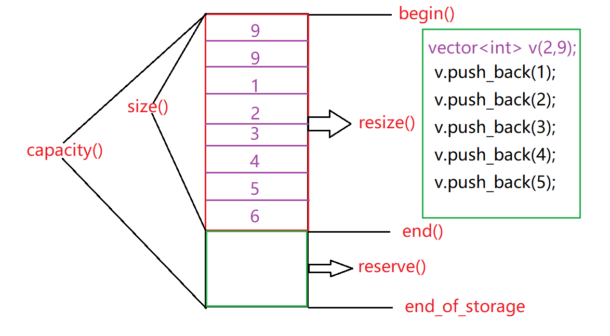

* [strlen 的常规写法和递归写法](#strlen-的常规写法和递归写法)
	* [常规写法](#常规写法)
	* [递归写法](#递归写法)
* [strcpy 和 strncpy 的代码和区别及安全性](#strcpy-和-strncpy-的代码和区别及安全性)
	* [strcpy](#strcpy)
		* [为什么要返回 char* 类型](#为什么要返回-char-类型)
		* [strcpy 和 memcpy 的区别](#strcpy-和-memcpy-的区别)
	* [strncpy](#strncpy)
* [快速排序的实现 & 复杂度](#快速排序的实现-复杂度)
	* [什么是快速排序](#什么是快速排序)
	* [快速排序算法的改进方面](#快速排序算法的改进方面)
* [设计一个内存池(一)](#设计一个内存池一)
	* [首先我们来说什么是内存池](#首先我们来说什么是内存池)
	* [内存池设计](#内存池设计)
* [内存池设计（二）](#内存池设计二)
* [字符串的反转](#字符串的反转)
	* [C++ string 实现逆序](#c-string-实现逆序)
	* [一般字符串反转算法](#一般字符串反转算法)
* [多态概念及实现方式](#多态概念及实现方式)
	* [什么是多态](#什么是多态)
	* [实现方式](#实现方式)
		* [实现运行时需要满足的 3 个条件](#实现运行时需要满足的-3-个条件)
	* [多态的作用](#多态的作用)
* [STL 中 map 和 vector 底层](#stl-中-map-和-vector-底层)
	* [map](#map)
	* [vector](#vector)
		* [vector 的扩容增长算法](#vector-的扩容增长算法)
* [为什么构造函数不可以是虚函数，多态中父类析构函数可以设成虚函数，这是为了防止哪种情况发生，可能造成什么后果](#为什么构造函数不可以是虚函数多态中父类析构函数可以设成虚函数这是为了防止哪种情况发生可能造成什么后果)
	* [为什么构造函数不可以是虚函数](#为什么构造函数不可以是虚函数)
	* [虚析构函数](#虚析构函数)
	* [基类派生类构造函数与析构函数执行顺序](#基类派生类构造函数与析构函数执行顺序)

# strlen 的常规写法和递归写法

## 常规写法

```cpp
int my_strlen(const char* str){
    int _count = 0;
    while(*str != '\0'){
        _count++;
        str++;
    }
    return _count;
}
```

## 递归写法

```cpp
int my_strlen(const char* str){
    int _count = 0;
    if(*str == '\0')
        return 0;
    else
        return 1 + my_strlen(str + 1)
}
```

# strcpy 和 strncpy 的代码和区别及安全性

## strcpy

```cpp
char* my_strcpy(char* dst, const char* src){
    assert(dst != nullptr);
    assert(src != nullptr);
    char* tmp = dst;
    while(* tmp++ = *src++)
        ;
    return tmp;
}
```

### 为什么要返回 char* 类型

为了实现链式连接，返回内容为指向目标内存的地址指针，这样可以在需要字符指针的函数中使用 strcpy，

源地址和目标地址出现内存重叠时，如何保证复制的正确性

使用检测内存重叠机制 memcpy

```cpp
char* my_memcpy(char* dst, const char* src, int size){
    assert(dst != nullptr);
    assert(src != nullptr);
    if(dst == nullptr || src == nullptr)
        return nullptr;
    char* tmp = dst;
    //从高地址开始拷贝
    if(dst > src && dst < src + size - 1){
        dst = dst + size - 1;
        src = src + size - 1;
    }
    while(size--){
        *dst-- = *src--;
    }
    else
        while(size--){
            *dst++ = *src++;
        }
    return tmp;
}
```

### strcpy 和 memcpy 的区别

- strcpy 提供了字符串的复制，但是仅仅用于字符串的复制，不仅复制字符串内容而且还会将字符串结束标志复制
- memcpy 对于拷贝的内容没有限制，其第三个参数用来决定复制的长度

## strncpy

**首先我会这么实现**

```cpp
char* my_strncpy(char* dst, const char* src, int size){
    assert(dst != nullptr);
    assert(src != nullptr);
    char* tmp = dst;
    while(len--){
        *dst++ = *src++;
    }
    return tmp;
}
```

**如果是这样写的话，会出现一些问题**

- 拷贝完的字符串并没有结束标志
- 如果目的字符串的长度比 size 小该如何是好
- 如果源字符串的长度比 size 小或者大又该如何是好
- 什么时候会出现内存重叠（出现内存重叠应该从高地址往低地址拷贝）
- 其实 strncpy 的目的就是向目的字符串中写入 size 个字符；

**针对以上有几种解决方案**

- 如果 size < strlen(src) 那么拷贝至目的串中的字符串将不会以 '\0' 结尾，所以要在拷贝完成后追加字符串结尾标志
- 如果 size > strlen(dst) 那么拷贝至目的串中的字符串就会覆盖掉原来字符串的结尾标志，这样的话应该考虑到内存重叠，从高地址向低地址拷贝，即从后向前复制
- 如果内存重叠和源字符串的长度不够 size，这又改如何解决，这样做：内存重叠我们可以从后向前拷贝，源字符串长度小于 size 则在目的串的后面补 NULL，然后再追加 '\0'

# 快速排序的实现 & 复杂度

## 什么是快速排序

首先选定一个值，然后扫描待排序序列，把小于该值的记录和大于该值的记录分成两个单独的序列，然后分别对这两个序列进行上述操作，这就是排序。`其一般步骤为：`

- 从数列中挑选一个元素，我们将其称为 “基准值”
- 重新排序此序列，把比基准小的元素放在基准的前面，大于基准的元素放在基准的后边，这样的操作称为分区（partition）
- 递归地把小于基准的子序列和大于基准的子序列进行上述操作

```cpp
void quicksort(int array[], int left, int right){
    int key = array[left];
    int i = left, j = right;
    if(left >= right)
        return ;
    //一趟快速排序
    while(i < j){
        while(i < j && array[j] >= key)
            j--;
        array[i] = array[j];	//如果基准后边的值小于基准，则交换
        while(i < j && array[i] <= key)
            i++;
        array[j] = array[i];	//如果基准前面的值大于基准，则交换
    }
    array[i] = key;	//基准值归位
    //分别对左右两个子序列排序
    quicksort(array, left, i - 1);
    quicksort(array, i + 1, right);
}
```

**算法分析**

- 上述算法在选取基准值的时候，选的是最左边的元素，这样的话在已经有序的序列中，每次划分得到最坏的情况，`解决办法就是在选取基准值的时候随机选取，增加其随机性`

- 随机化算法 `partition`

- ```cpp
  int random(int array[], int left, int right){
      int i = rand() % (right - left) + left;
      swap(array[i], array[left]);
      return array[left];
  }
  int partition(int array[], int left, int right){
      int i = left, j = right;
      int key = random(array, left, right);
      while(i < j)
      {
          while(i < j && array[j] >= key)
              j--;
          array[i] = array[j];
          while(i < j && array[i] <= key)
              i++;
          array[i] = array[j];
      }
      array[i] = key;
      return i;
  }
  void quicksort(int array[], int left, int right){
      if(left >= right)
          return ;
      int p = partition(array, left, right);
      quicksort(array, left, p - 1);
      quicksort(array, p + 1, right);
  }
  
  int partition(T[] nums, int l, int h) {
      int i = l, j = h + 1;
      T v = nums[l];
      while (true) {
          while (less(nums[++i], v) && i != h) ;
          while (less(v, nums[--j]) && j != l) ;
          if (i >= j)
              break;
          swap(nums, i, j);
      }
      swap(nums, l, j);
      return j;
  }
  
  int partition(int nums[], int left, int right){
      int i = left, int j = right;
      int key = nums[left];
      while(i < j){
          while(nums[i] <= key && i != right)
              i++;
          while(nums[j] >= key && j != left)
              j--;
          swap(nums[i], nums[j]);
      }
      swap(nums[left], nums[j]);
      return j;
  }
  ```

  

## 快速排序算法的改进方面

- 基准值的选区（推荐随机化）
- 根据产生的子分区不断调整算法
- 划分分区的方式

# 设计一个内存池(一)

## 首先我们来说什么是内存池

通常我们使用 new 和 amlloc 来分配内存的话，由于申请的大小不确定，所以当频繁使用时会造成内存碎片和效率的降低，为了克服这一问题，我们提出了内存池，内存池是一种内存的分配方式，其优点是有效地减少内存碎片化，分配内存更快速，减少内存泄漏

## 内存池设计

- 初始化，在创建内存池的时候为内存池分配了一块很大的内存，便于以后使用
- 分配内存，当需要内存的时候就去内存池里面分配内存
- 回收内存，当从内存池分配而来的内存使用完毕后，就需要将这块内存释放掉

设计的主要问题就是：`如何重复利用释放回来的内存，可以达到较高的效率`

```cpp
//用链表来实现内存池，每一个结点都挂有一块内存
template<class T>
class ObjectPool
{
   struct BlockNode         //每一个结点类型
   {
       void* _memory;        //指向一块已经分配的内存
       BlockNode * _next;    //指向下一个结点
       size_t _objNum;       //记录这块内存中对象的个数
       BlockNode(size_t objNum)
           :_objNum(objNum)
           , _next(NULL)
       {
           _memory = malloc(_objNum*_itemSize);
       }
       ~BlockNode()
       {
           free(_memory);
           _memory = NULL;
           _next = NULL;
           _objNum = 0;
       }
   };
protected:
    size_t _countIn;      //当前结点的在用的计数
    BlockNode* _frist;    //指向链表的头
    BlockNode* _last;     //指向链表的尾
    size_t _maxNum;        //记录内存块最大的容量
    static size_t _itemSize;   //单个对象的大小
    T* _lastDelete;        //指向最新释放的那个对象的空间
public:
	ObjectPool(size_t initNum = 32, size_t maxNum = 100000)  //默认最开始内存块有32个对象，一个内存块最大有maxNum个对象
        :_countIn(0)
        , _maxNum(maxNum)
        , _lastDelete(NULL)
	{
    	_frist = _last =new BlockNode(initNum);   //先开辟一个结点，这个结点里面的内存块能够存放initNum个对象
    }
	~ObjectPool()
   	{
        Destory();
    }
    T* New()                   //分配内存
    {
        if (_lastDelete)         //先到释放已经用完并且换回来的内存中去找
        {
            T* object = _lastDelete;
            _lastDelete = *((T**)_lastDelete);  //将_lastDelete转换成T**，*引用再取出来T*，也就是取出前T*类型大小的单元
            return new(object) T();        //把这块内存用从定位new初始化一下
        }
        //判断还有没有已经分配的内存且还未使用,如果没有内存的话就要再分配内存
        if (_countIn >= _last->_objNum)     //大于等于表示没有了，这时候就要分配内存了
        {
            size_t size =2*_countIn;
            if (size > _maxNum)            //块的最大大小不能超过maxNum，如果没超过就以二倍增长
                size = _maxNum;
            _last->_next = new BlockNode(size);
            _last = _last->_next;
            _countIn = 0;
        }
        //还有已经分配好的未被使用的内存
        T* object =(T*)（(char*)_last->_memory + _countIn*_itemSize）;
        _countIn++;
        return new(object) T();        //将这块空间用重定位new初始化一下
    }
    void Destory()
    {
        BlockNode *cur = _frist;
        while (cur)
        {
        	BlockNode* del = cur;
            cur = cur->_next;
            delete del;            //会自动调用~BlockNode()
        }
        _frist = _last = NULL;
    }
    void Delete(T* object)          //释放内存
    {
        if (object)
        {
            object->~T();       
            *((T**)object) = _lastDelete;      //将_lastDelete里面保存的地址存到tmp指向空间的前T*大小的空间里面
            _lastDelete = object;
        }
    }
protected:
	static size_t GetItemSize()
    {
        if (sizeof(T)>sizeof(T*))
        {
            return sizeof(T);
        }
        else
        {
            return sizeof(T*);
        }
    }
};
template<typename T>
size_t ObjectPool<T>::_itemSize =ObjectPool<T>::GetItemSize();          //类外初始化静态变量_itemSize
```

# 内存池设计（二）

[!Documents]()

# 字符串的反转

## C++ string 实现逆序

```cpp
std::string reverse(std::string str){
    std::string s(str.rbegin(), str.rend());
    return s;
} 
```

## 一般字符串反转算法

```cpp
void reverse(char* left, char* right){
    assert(left != nullptr);
    assert(right != nullptr);
    while(left < right){
        *left ^= *right;
        *right ^= *left;
        *left ^= *right;
        left++;
        right--;
    }
}
```

# 多态概念及实现方式

## 什么是多态

首先多态是面向对象的重要特性，简单来说就是一个接口的多种实现，基类的指针或引用调用子类的对象 or 方法，编译时多态就是靠函数重载，而运行时多态的实现机制就是虚函数

## 实现方式

编译时多态通过运算符重载、函数重载、模板来实现

运行时多态通过虚函数、抽象类、接口来实现

### 实现运行时需要满足的 3 个条件

- 基类与派生类之间用 public 继承
- 基类中函数声明为虚函数
- 通过基类的指针或引用调用虚函数
- 子类重写父类的虚函数

`多态与非多态的实质区别就是函数地址的早绑定还是晚绑定，如果函数的调用在编译期间就可以确定函数的调用地址，并生产代码，是静态的，可以说这就是早绑定，而如果函数的调用地址在运行时确定，这就属于晚绑定`

## 多态的作用

我们都知道封装可以使得代码模块化，继承可以扩展已存在的代码，他们的目的都是为了代码重用，`而多态的目的就是为了接口重用，也就是说，不论传递过来究竟是哪个类的对象，函数都能通过同一个接口调用到适应各自对象的实现方法`

最常用的方法就是，声明基类的指针，利用该指针指向任意一个子对象，调用相应的虚函数，可以根据指向的子类不同而实现不同的方法，如果没有虚函数的话，即没有利用 C++ 多态性，则利用基类的指针调用相应函数的时候，总被限制在基类函数本身，无法调用到子类中被重写过的 函数

`Java 与 c++ 中多态的区别：单继承下可以说都是通过方法表，只不过一个在编译时确定方法表，另一个在调用时调用方法表`

# STL 中 map 和 vector 底层

## map

STL 中 map 是基于 RBTree 的，以 key-value 形式存储，关键词起到索引的作用，插入删除等操作的时间复杂度都是 O(logn)

- 添加数据--log(n)
  - map.insert(pair<int, string>(100, "hello world!!!"));
  - map.insert(pair<int, string>::value_type(100, "hello world!!!"));
  - map[100] = "hello world!!!";
- 元素查找--(logn)
  - map.find(key) 返回一个迭代器指向键值为 key 的元素，如果没有找到则指向 map 尾部的迭代器
- 删除元素--(logn)
  - 先查找元素，map<int, string>::iterator it = map.find(key);找到之后进行 map.erase(it)；
- map 中的 swap 函数
  - 交换的是两个容器而不是一个容器中的元素进行交换
- sort 函数
  - map 中的 key 是按照升序进行排列的，所以不能使用 sort 函数

## vector

vector 底层通过一个连续的数组存放元素，如果集合已满，在新插入数据的时候，就要分配一块更大的内存，将原来的数据复制过来，释放掉之前的内存，进而继续插入元素，

- 插入元素：可通过 push_back() 在尾部插入，也可以通过迭代器 iterator 在任意位置插入，我来说一下迭代器的插入，通过迭代器与首元素的距离直到要插入的位置，即 int index = iter.begin()，这个元素后面的所有元素都向后移动一个位置，在空出来的地方插入新元素。
- 删除元素：类似于插入元素，可以在尾部删除，也可以在任意位置删除，要说明一点，通过 rease() 删除元素并没有释放内存（内存在析构函数中释放），仅仅是初始化为默认值
- 至于迭代器，STL 中为每个容器都设置了自己的迭代器，以及迭代器失效后面总结

### vector 的扩容增长算法



`begin() 迭代器指向已用空间的首元素，end()指向已用空间的尾元素的下一个位置，end_of_storage指向空间的末尾size()函数返回的是已用空间的大小，capacity()返回的是总空间的大小，当size()和capacity()相等时就会引起vector的动态增长，由于动态增长会引起重新分配空间，拷贝原空间，释放原空间，这些过程会降低效率，因此可以用reserve()预先分配一块较大的内存空间，这样当指定大小的内存空间未使用完时，是不会重新分配内存空间的，只有当n>capacity()时，才会改变vector容量`

- 在 VS 编译器中，内存增长由编译器来完成，这个自动增长过程包括：分配内存空间、拷贝原空间、释放原空间三个过程，具体来说便是，当添加新元素时，如果 vector 空间大小不足，则会以原大小的 1.5 倍进行扩容，然后将原空间的内容拷贝过来，在新空间的末尾添加新元素，并释放原空间，也就是说 vector 的空间增加大小并不是在原来的空间之后相邻的位置增加新空间，因为 vector 的空间是线性连续分配的，不能保证原空间后有足够的配置空间，

# 为什么构造函数不可以是虚函数，多态中父类析构函数可以设成虚函数，这是为了防止哪种情况发生，可能造成什么后果

## 为什么构造函数不可以是虚函数

- 当构造函数去构造一个对象的时候，必须知道对象的实际类型，而虚函数行为是运行时才确定实际类型的，而在构造一个对象时，由于对象还未构造成功，编译器无法知道对象的实际类型是该类本身还是派生类又或者是别的
- 虚函数执行依赖于虚函数表，而虚函数表在构造函数中进行初始化工作，即初始化 vptr，让它指向正确的虚函数表

`虚函数调用是在部分信息下完成工作的机制，允许我们只知道接口而不知道对象的确切类型。 要创建一个对象，你需要知道对象的完整信息。 特别是，你需要知道你想要创建的确切类型。 因此，构造函数不应该被定义为虚函数。`

`虚函数的作用在于通过子类的指针或引用来调用父类的那个成员函数。而构造函数是在创建对象时自己主动调用的，不可能通过子类的指针或者引用去调用。`

## 虚析构函数

假如基类的析构函数没有被设置为虚函数，当析构一个指向派生类的成员基类指针，这时程序不知道该怎么办，可能会造成内存泄漏，因此基类的析构函数要设置为析构函数要定义为虚函数

基类指针可以指向派生类的对象（多态），如果删除该指针 delete[] p，就会调用该指针指向的派生类的析构函数，而派生类的对象又会自动调基类的成员函数，这样就会把派生类的对象释放，如果基类的析构函数没有定义成虚函数，则编译器实现的静态绑定，在删除基类的指针，只会释放基类的析构函数而不会释放派生类的成员函数，此时会导致释放内存不完全，就会导致内存泄露的问题

## 基类派生类构造函数与析构函数执行顺序

- 析构派生类->析构基类
- 构造基类->构造派生类

